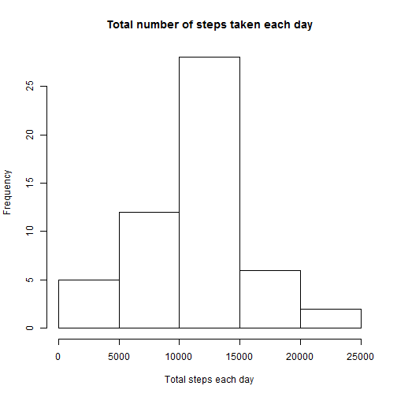
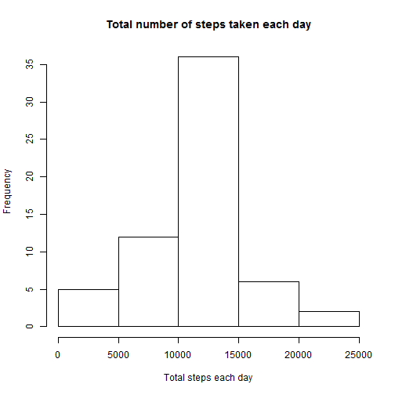
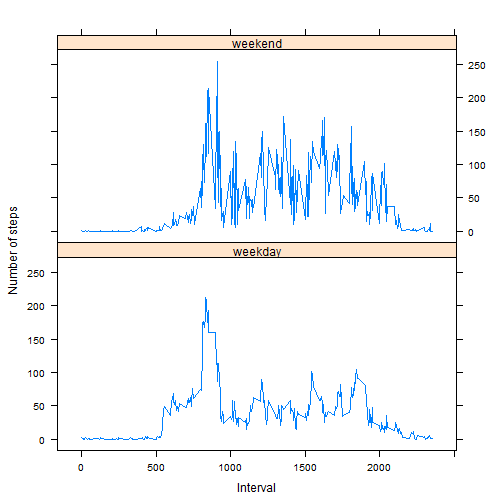

First, load the R packages for this analysis.


```r
library(plyr)
library(dplyr)
library(lattice)
```

## Loading and preprocessing the data 

```r
data <- read.csv("./repdata-data-activity/activity.csv")
str(data)
```

```
## 'data.frame':	17568 obs. of  3 variables:
##  $ steps   : int  NA NA NA NA NA NA NA NA NA NA ...
##  $ date    : Factor w/ 61 levels "2012-10-01","2012-10-02",..: 1 1 1 1 1 1 1 1 1 1 ...
##  $ interval: int  0 5 10 15 20 25 30 35 40 45 ...
```

## What is mean total number of steps taken per day? 
Missing values are ignored for this part.

**1. Calculate the total number of steps taken per day**

```r
data2 <- data[!is.na(data$steps),]
str(data2)
```

```
## 'data.frame':	15264 obs. of  3 variables:
##  $ steps   : int  0 0 0 0 0 0 0 0 0 0 ...
##  $ date    : Factor w/ 61 levels "2012-10-01","2012-10-02",..: 2 2 2 2 2 2 2 2 2 2 ...
##  $ interval: int  0 5 10 15 20 25 30 35 40 45 ...
```

```r
by_day <- group_by(data2,date)
sum <- summarise(by_day,totalsteps=sum(steps))
sum
```

```
## Source: local data frame [53 x 2]
## 
##          date totalsteps
## 1  2012-10-02        126
## 2  2012-10-03      11352
## 3  2012-10-04      12116
## 4  2012-10-05      13294
## 5  2012-10-06      15420
## 6  2012-10-07      11015
## 7  2012-10-09      12811
## 8  2012-10-10       9900
## 9  2012-10-11      10304
## 10 2012-10-12      17382
## ..        ...        ...
```

**2. Make a histogram of the total number of steps taken each day**

```r
hist(sum$totalsteps, xlab="Total steps each day", main="Total number of steps taken each day")
```

 

**3. Calculate and report the mean and median of the total number of steps taken per day**

```r
mean(sum$totalsteps)
```

```
## [1] 10766.19
```

```r
median(sum$totalsteps)
```

```
## [1] 10765
```


## What is the average daily activity pattern? 
Missing values are ignored for this part.

**1. Make a time series plot of the 5-minute interval (x-axis) and the average number of steps taken, averaged across all days (y-axis)**

```r
by_interval <- group_by(data2,interval)
sum2 <- summarize(by_interval, avgstep = mean(steps))
sum2
```

```
## Source: local data frame [288 x 2]
## 
##    interval   avgstep
## 1         0 1.7169811
## 2         5 0.3396226
## 3        10 0.1320755
## 4        15 0.1509434
## 5        20 0.0754717
## 6        25 2.0943396
## 7        30 0.5283019
## 8        35 0.8679245
## 9        40 0.0000000
## 10       45 1.4716981
## ..      ...       ...
```

```r
plot(sum2$interval,sum2$avgstep, type="l", xlab="Interval", ylab="Number of steps")
```

 

**2. Which 5-minute interval, on average across all the days in the dataset, contains the maximum number of steps?**

```r
maxstep <- max(sum2$avgstep)
sum2[sum2$avgstep==maxstep,]
```

```
## Source: local data frame [1 x 2]
## 
##   interval  avgstep
## 1      835 206.1698
```


## Imputing missing values

**1. The total number of missing values in the dataset**

```r
my_na <- is.na(data)
sum(my_na)
```

```
## [1] 2304
```

**2. Impute the missing value, using the mean for that 5-mintue interval**

Create a data frame to include NA only and merge it with summarized data set by interval to get mean for the 5-minute interval.

```r
x <- data[is.na(data),]
y <- left_join(x,sum2, by="interval")
# remove original column with NA values and use mean instead
z <- select(y,avgstep,date,interval)
colnames(z) <- c("steps","date","interval")
head(z,10)
```

```
##        steps       date interval
## 1  1.7169811 2012-10-01        0
## 2  0.3396226 2012-10-01        5
## 3  0.1320755 2012-10-01       10
## 4  0.1509434 2012-10-01       15
## 5  0.0754717 2012-10-01       20
## 6  2.0943396 2012-10-01       25
## 7  0.5283019 2012-10-01       30
## 8  0.8679245 2012-10-01       35
## 9  0.0000000 2012-10-01       40
## 10 1.4716981 2012-10-01       45
```

**3. Create a new dataset that is equal to the original dataset but with the missing data filled in.**

```r
w <- rbind(data2,z)
w <- arrange(w,date,interval)
head(w)
```

```
##       steps       date interval
## 1 1.7169811 2012-10-01        0
## 2 0.3396226 2012-10-01        5
## 3 0.1320755 2012-10-01       10
## 4 0.1509434 2012-10-01       15
## 5 0.0754717 2012-10-01       20
## 6 2.0943396 2012-10-01       25
```

```r
summary(w)
```

```
##      steps                date          interval     
##  Min.   :  0.00   2012-10-01:  288   Min.   :   0.0  
##  1st Qu.:  0.00   2012-10-02:  288   1st Qu.: 588.8  
##  Median :  0.00   2012-10-03:  288   Median :1177.5  
##  Mean   : 37.38   2012-10-04:  288   Mean   :1177.5  
##  3rd Qu.: 27.00   2012-10-05:  288   3rd Qu.:1766.2  
##  Max.   :806.00   2012-10-06:  288   Max.   :2355.0  
##                   (Other)   :15840
```

**4. Make a histogram of the total number of steps taken each day**

```r
by_day_new <- group_by(w,date)
sum_new <- summarize(by_day_new,totalsteps=sum(steps))
sum_new
```

```
## Source: local data frame [61 x 2]
## 
##          date totalsteps
## 1  2012-10-01   10766.19
## 2  2012-10-02     126.00
## 3  2012-10-03   11352.00
## 4  2012-10-04   12116.00
## 5  2012-10-05   13294.00
## 6  2012-10-06   15420.00
## 7  2012-10-07   11015.00
## 8  2012-10-08   10766.19
## 9  2012-10-09   12811.00
## 10 2012-10-10    9900.00
## ..        ...        ...
```

```r
hist(sum_new$totalsteps, xlab="Total steps each day", main="Total number of steps taken each day")
```

 

**5. Calculate and report the mean and median total number of steps taken per day**

```r
mean(sum_new$totalsteps)
```

```
## [1] 10766.19
```

```r
median(sum_new$totalsteps)
```

```
## [1] 10766.19
```
These values differ from the estimates from the first part of the assignment. After imputing the missing values, the median equals to the mean.


## Are there differences in activity patterns between weekdays and weekends?
**1. Create a new factor variable in the dataset with two levels - "weekday" and "weekend" indicating whether a given date is a weekday or weekend day**

```r
w$weekd <- weekdays(as.Date(as.character(w$date)))
w1 <- w[w$weekd==c("Sunday","Saturday"),]
w1$dayind <- "weekend"
w2 <- w[w$weekd!=c("Sunday","Saturday"),]
w2$dayind <- "weekday"
combinedw <- rbind(w1,w2)
head(combinedw)
```

```
##      steps       date interval    weekd  dayind
## 1442     0 2012-10-06        5 Saturday weekend
## 1444     0 2012-10-06       15 Saturday weekend
## 1446     0 2012-10-06       25 Saturday weekend
## 1448     0 2012-10-06       35 Saturday weekend
## 1450     0 2012-10-06       45 Saturday weekend
## 1452     0 2012-10-06       55 Saturday weekend
```

```r
# tail(combinedw)
```

**2. Make a panel plot containing a time series plot (i.e. type = "l") of the 5-minute interval (x-axis) and the average number of steps taken, averaged across all weekday days or weekend days (y-axis).**

```r
by_interval_new <- group_by(combinedw,dayind,interval)
sum2_new <- summarize(by_interval_new, avgstep = mean(steps))
# sum2_new
xyplot(avgstep ~ interval | dayind, data = sum2_new, layout = c(1,2), type = "l", xlab="Interval", ylab="Number of steps")
```

 
